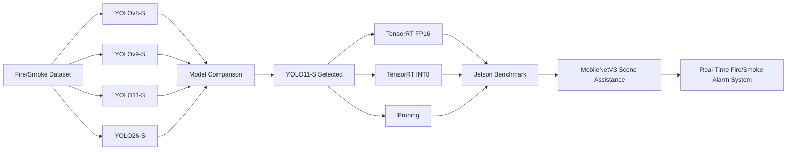

# Real-Time Fire and Smoke Detection with YOLO and Edge Deployment

This repository contains the training, evaluation, optimization, and Jetson deployment code for a real-time fire and smoke detection system.

The project first compares four YOLO detector variants under a common experimental workflow. YOLO11-S is then selected for further edge optimization and deployment on an NVIDIA Jetson Orin Nano. The final system combines YOLO-based object detection with an optional MobileNetV3 scene classifier and a dynamic alarm mechanism.


> **Repository note:** The full Kaggle image dataset, trained model binaries, TensorRT engines, and raw benchmark videos are intentionally not included in normal Git history. The repository contains the reproducible source code, configurations, notebooks, and curated documentation required to review the experimental workflow.

## Project Workflow



## Repository Structure

```text
msc26-yolo/
├── README.md
├── requirements.txt
├── requirements_jetson.txt
├── configs/
│   ├── data.yaml
│   ├── int8_calibration.yaml
│   └── README.md
├── training/
│   ├── yolov8_training.ipynb
│   ├── yolov9_training.ipynb
│   ├── yolo11_training.ipynb
│   ├── yolo26_training.ipynb
│   └── README.md
├── evaluation/
│   ├── model_comparison/
│   ├── pc/
│   ├── jetson/
│   └── README.md
├── optimization/
│   ├── tensorrt/
│   ├── pruning/
│   ├── benchmark/
│   ├── evaluation/
│   └── README.md
├── deployment/
│   ├── jetson_fire_alarm.py
│   └── README.md
├── models/
│   └── README.md
├── results/
│   └── README.md
└── docs/
    ├── DATASET.md
    ├── EXPERIMENTAL_SETUP.md
    └── REPRODUCIBILITY.md
```

## Dataset

The experiments use the Kaggle fire and smoke detection dataset identified as:

```text
sayedgamal99/smoke-fire-detection-yolo
```

The original dataset contains training, validation, and test splits. The full image dataset is not stored in this repository. Dataset configuration files are kept under `configs/`.

See [`docs/DATASET.md`](docs/DATASET.md) for details.

## Model Training

Four detector variants are trained and evaluated under the same core experimental settings:

| Setting | Value |
|---|---:|
| Input image size | 640 |
| Training epochs | 100 |
| Random seed | 42 |
| Nominal batch size | 16 |

The completed YOLOv9-S run used batch size 8 because of the training configuration used for that experiment; the other three formal runs used batch size 16. This exception is retained in the training notebook for reproducibility. All training notebooks are stored under `training/`.

## Model Comparison

The four trained models are compared using detection metrics and deployment-oriented properties, including:

- Precision
- Recall
- mAP@50
- mAP@50:95
- Model size
- Parameter count / model complexity where available
- Inference latency
- End-to-end FPS

The comparison workflow is stored under `evaluation/model_comparison/`. Based on the overall balance between detection performance and runtime characteristics, YOLO11-S is used as the primary model for the subsequent optimization stage.

## Runtime Evaluation

Runtime benchmarks are performed on both a PC environment and the NVIDIA Jetson platform. The benchmark scripts record frame-level and run-level information such as:

- End-to-end FPS
- Pre-processing latency
- Inference latency
- Post-processing latency
- Detection counts
- Fire/smoke frame rates
- Detection confidence
- Model size
- Hardware and software environment information

The PC scripts support either GPU or CPU inference through the `--device` argument. Jetson-specific scripts use the camera interface available on the target device.

Example:

```bash
python evaluation/pc/run_yolo11.py \
  --model models/yolo11s_best.pt \
  --source 0 \
  --device 0 \
  --conf 0.15 \
  --imgsz 640 \
  --duration 60 \
  --test-id fire01
```

## YOLO11-S Edge Optimization

After model selection, YOLO11-S is further optimized for Jetson deployment using three main approaches.

### TensorRT FP16

The trained PyTorch model is exported to a TensorRT FP16 engine on the target Jetson device.

```bash
python optimization/tensorrt/export_fp16_tensorrt.py \
  --model models/yolo11s_best.pt \
  --output models/yolo11s_best_fp16.engine
```

### TensorRT INT8

INT8 export uses representative fire/smoke calibration data and a dedicated calibration YAML file.

```bash
python optimization/tensorrt/export_int8_tensorrt.py \
  --model models/yolo11s_best.pt \
  --data configs/int8_calibration.yaml \
  --output models/yolo11s_best_int8.engine
```

### Pruning

A pruning-friendly YOLO11 module definition and P20 pruned model workflow are included under `optimization/pruning/`. The pruned model can also be exported to TensorRT for Jetson inference.

## Optimization Evaluation

Optimized models are evaluated using both labelled validation data and runtime benchmarks.

The evaluation utilities support:

- Validation of `.pt` and `.engine` models
- Precision / Recall / mAP reporting
- Confidence-threshold sweep
- Baseline vs optimized runtime comparison
- Consolidation of accuracy and runtime results into a comparison table

Example validation command:

```bash
python optimization/evaluation/validate_model.py \
  --model models/yolo11s_best_fp16.engine \
  --data configs/data.yaml \
  --output val_fp16.json
```

## Final Jetson System

The final deployment application integrates:

- YOLO fire/smoke detection
- Runtime model discovery and switching
- Optional MobileNetV3-Small scene classification
- Configurable scene-classification interval
- Dynamic fire/smoke warning and alarm states
- Live camera stream
- FPS and latency monitoring
- Alarm history
- CSV / JSON result logging
- Alarm screenshots
- Optional annotated video recording
- Browser-based interface using Flask

The scene classifier supports `default`, `fire`, and `smoke` scene probabilities. Scene assistance can be enabled or disabled during deployment.

Run the final application on Jetson with:

```bash
python deployment/jetson_fire_alarm.py
```

Then open:

```text
http://127.0.0.1:5000
```

## Results

Only curated result tables and figures should be committed to the `results/` directory. Large raw benchmark folders, generated videos, model weights, and full datasets are intentionally excluded from normal Git version control.

Recommended result groups are:

```text
results/
├── model_comparison/
├── runtime_comparison/
├── optimization/
└── final_system/
```

See [`results/README.md`](results/README.md) for the recommended file naming convention.

## Model Files

Large model files such as `.pt`, `.engine`, `.onnx`, and `.pth` are excluded by default from Git. Their expected names and roles are documented in [`models/README.md`](models/README.md).

If model binaries need to be shared through GitHub, Git LFS should be used instead of normal Git tracking.

## Reproducibility

Experiment parameters, dataset configuration, software versions, and output summaries should be retained with each experiment. Platform-specific details are described in:

- [`docs/EXPERIMENTAL_SETUP.md`](docs/EXPERIMENTAL_SETUP.md)
- [`docs/REPRODUCIBILITY.md`](docs/REPRODUCIBILITY.md)

## Notes

TensorRT engines are hardware- and software-environment dependent. FP16 and INT8 engines should therefore be generated on the target Jetson environment used for deployment and benchmarking.
